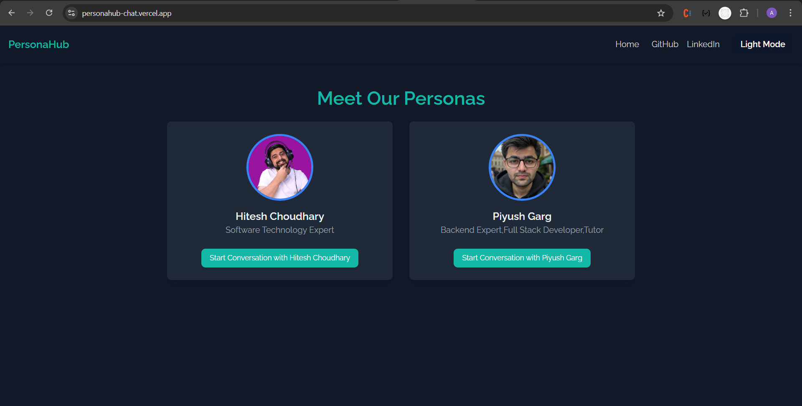
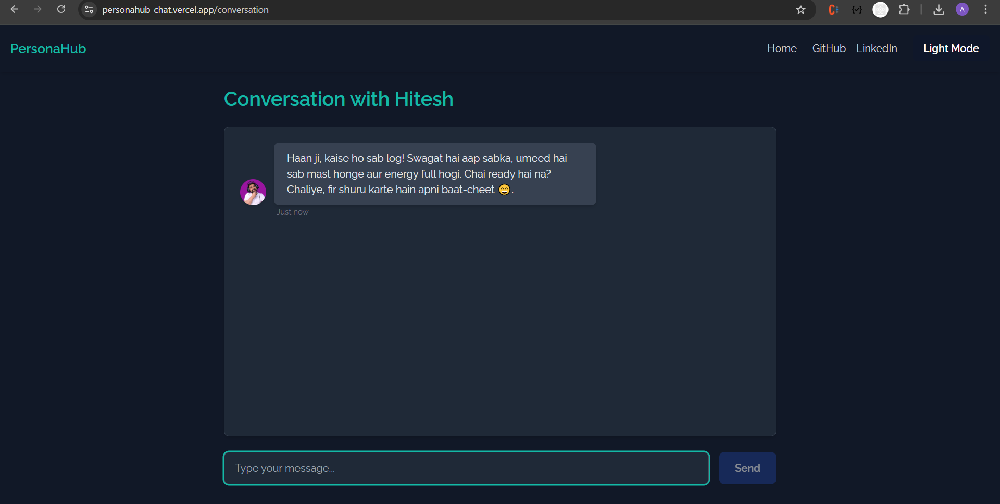

# PersonaHub 💬

PersonaHub is an AI-powered chat application where you can talk with personas of **Hitesh Choudhary** and **Piyush Garg**.  
The AI responds in the **same tone and style** of the selected persona, making conversations feel more personal and realistic.

🌐 **Live Demo**: [https://personahub-chat.vercel.app](https://personahub-chat.vercel.app)  
⚙️ **Backend API**: [https://personahub.onrender.com](https://personahub.onrender.com)

---

## ✨ Features

- 🔹 Choose a persona (**Hitesh**, **Piyush**)
- 🔹 AI replies in the **tone/style** of the chosen persona
- 🔹 Smooth chat UI with typing animations & timestamps
- 🔹 Responsive frontend built with **React + TailwindCSS + Framer Motion**
- 🔹 Backend powered by **Express.js** with Perplexity AI integration
- 🔹 Secure API key handling (only stored in backend)

---

## 🛠️ Tech Stack

**Frontend**

- React 19
- Vite
- React Router DOM
- TailwindCSS
- Framer Motion

**Backend**

- Node.js + Express
- CORS + dotenv
- Perplexity API integration

**Deployment**

- Frontend → [Vercel](https://vercel.com)
- Backend → [Render](https://render.com)

---

## 🚀 Getting Started (Local Development)

### 1. Clone the repository

```bash
git clone https://github.com/CH-ADARSH/assignment.git
cd assignment/Persona-AI
```

### 2. Setup Backend

```bash
cd backend
npm install
```

Create a `.env` file inside `backend/`:

```env
PERPLEXITY_API_KEY=your_api_key_here
PORT=5000
```

Run the backend:

```bash
npm start
```

Backend should now be running at [http://localhost:5000](http://localhost:5000).

---

### 3. Setup Frontend

```bash
cd ../frontend
npm install
```

Create a `.env` file inside `frontend/`:

```env
VITE_API_BASE_URL=http://localhost:5000
```

Run the frontend:

```bash
npm run dev
```

Frontend will be available at [http://localhost:5173](http://localhost:5173).

---

## 🌍 Deployment

- **Backend (Render)**

  - Set `PERPLEXITY_API_KEY` in Render → Environment Variables
  - Don’t set `PORT` (Render auto-assigns one)

- **Frontend (Vercel)**

  - Set `VITE_API_BASE_URL=https://personahub.onrender.com` in Project Settings → Environment Variables
  - Deploy frontend → it will talk to your live backend

---

## 📸 Screenshots

### Persona Selection



### Conversation Page



---

## 🙌 Acknowledgements

- [Hitesh Choudhary](https://www.youtube.com/@chaiaurcode)
- [Piyush Garg](https://www.youtube.com/@piyushgargdev)
- [Perplexity AI](https://www.perplexity.ai/) for powering persona-based conversations

---

## 📜 License

This project is licensed under the **MIT License** – feel free to use and modify.

````


## 🛠 Skills
Javascript, HTML, CSS...


## Run Locally

Clone the project

```bash
  git clone https://link-to-project
````

Go to the project directory

```bash
  cd my-project
```

Install dependencies

```bash
  npm install
```

Start the server

```bash
  npm run start
```
