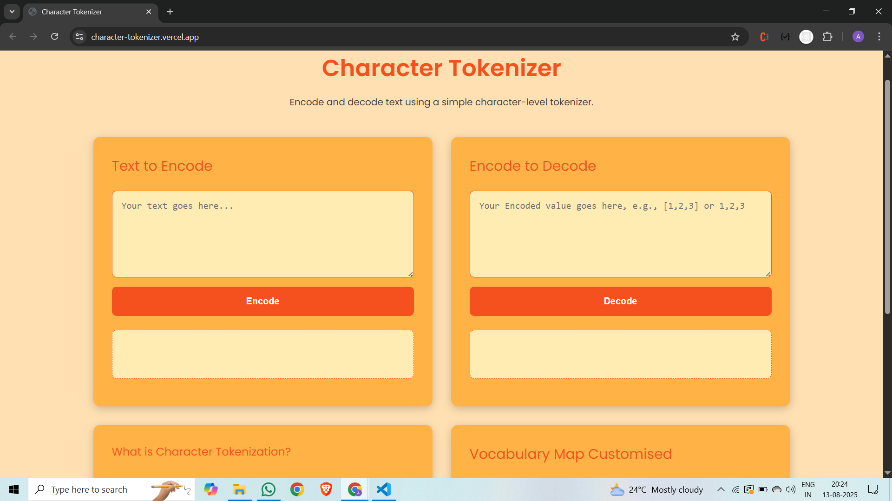

## 🌟 Character Based Tokenization

Project Link: https://character-tokenizer.vercel.app/

This project is a simple, character-level tokenizer built using HTML, CSS, and JavaScript. It provides a user-friendly interface to encode and decode text, a dynamic vocabulary list, and an informative section about tokenization.

---

### Screenshots

    

---

### ✨ Features

- **Encode Text:** Convert any text into a sequence of numerical tokens.
- **Decode Tokens:** Convert a sequence of numerical tokens back into text.
- **Dynamic Vocabulary:** View the character-to-token mapping for the text you've encoded.
- **Responsive Design:** The layout is clean and adapts to different screen sizes, from desktop to mobile.
- **Interactive UI:** A simple and intuitive interface for quick use.

---

### 🚀 Getting Started

To get a local copy up and running, follow these simple steps.

#### Prerequisites

This is a front-end project and does not require any special installation. You just need a modern web browser.

#### Installation

1.  Clone the repository:
    ```bash
    git clone https://github.com/CH-ADARSH/assignment/tree/main/character-tokenizer
    ```
2.  Navigate to the project directory:
    ```bash
    cd [character-tokenizer]
    ```
3.  Open `index.html` in your web browser.

---

### 🛠️ Tech Stack

- **HTML:** The core structure of the webpage.
- **CSS:** Styling and responsive design.
- **JavaScript:** Handling all the logic for tokenization, button clicks, and dynamic UI updates.
- **Font Awesome:** For the social media icons in the footer.

---

### 📂 Folder Structure

```
assignment
    └──character-tokenizer/
        ├── index.html          # Main HTML file
        ├── token.css           # Styling for the website
        ├── token.js            # JavaScript for the tokenizer logic
        └── README.md           # This file
```

---

### 🤝 Contributing

Contributions are what make the open-source community an amazing place to learn, inspire, and create. Any contributions you make are **greatly appreciated**.

1.  Fork the Project.
2.  Open a Pull Request.

---

### 🙏 Credits

- Inspired by the tokenization process in large language models.

---
